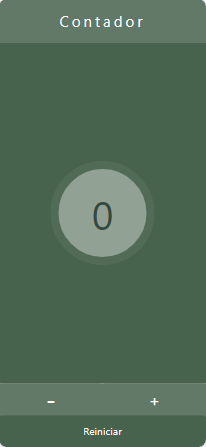

# Proyecto Contador

Este proyecto implementa un contador simple y responsive utilizando React y Chakra UI. 
Es un proyecto realizado como parte del curso impartido por la UTN.

## Descripción

El contador consta de tres elementos principales: un encabezado (`Heading`), un campo de entrada (`Input`) y tres botones (`Button`). Puedes incrementar, decrementar y reiniciar el contador utilizando los botones correspondientes.

## Tecnologías Utilizadas

- React
- Chakra UI

## Instrucciones de Uso

1. Clona este repositorio en tu máquina local.
2. Abre una terminal y navega al directorio del proyecto.
3. Ejecuta `npm install` para instalar las dependencias.
4. Ejecuta `npm start` para iniciar la aplicación en modo desarrollo.
5. Abre tu navegador y visita [http://localhost:3000](http://localhost:3000) para ver la aplicación.

## Autor

Maria Daniela Rivas
danielamackensy@gmail.com

## Contribuciones

Las contribuciones son bienvenidas. Si encuentras errores, mejoras o tienes nuevas ideas, ¡siéntete libre de contribuir al proyecto!

